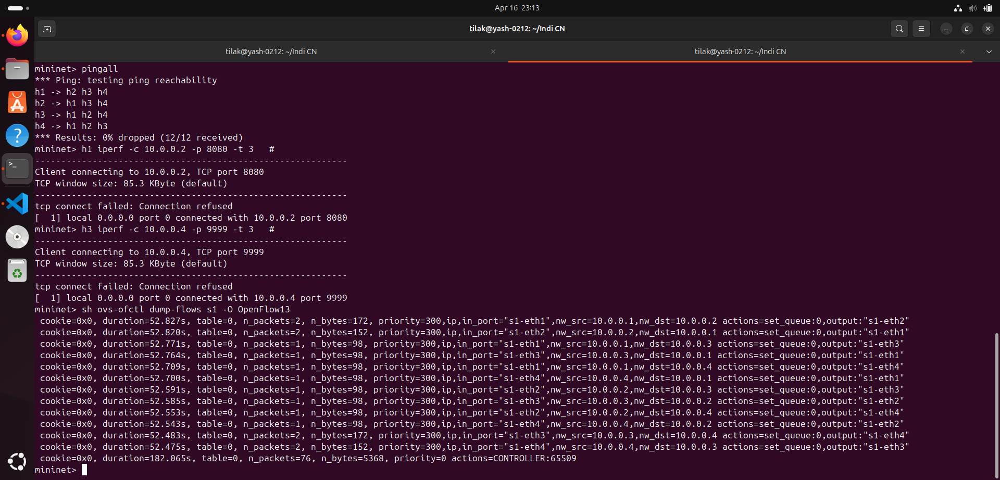
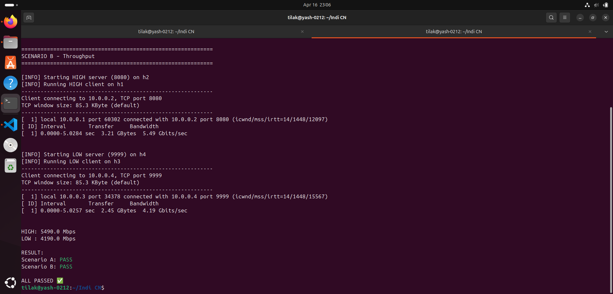
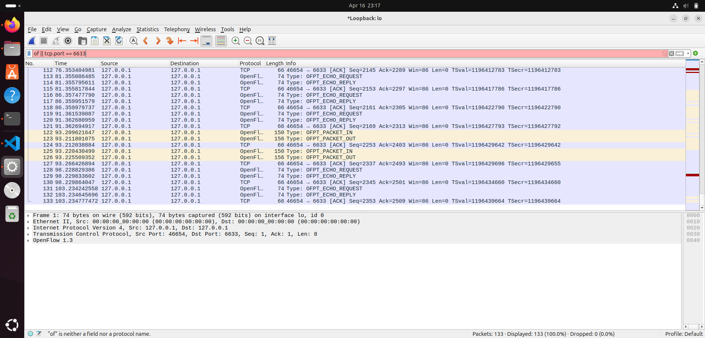

# 🚀 SDN QoS Priority Controller (Mininet + Ryu)

> **Simple QoS Priority Controller**
> Implements traffic classification and QoS using **Ryu Controller + OpenFlow 1.3 + Mininet**

---

# 📌 Problem Statement

**Prioritize certain traffic types over others using SDN rules.**

* Classify traffic (ICMP, TCP, etc.)
* Assign priorities
* Control bandwidth using queues
* Improve performance for critical traffic

---

# 🧠 Key Features

✅ Packet classification (ICMP, TCP ports)
✅ Queue-based QoS using Open vSwitch
✅ Flow rule installation (match → action)
✅ Latency & throughput validation
✅ Automated test scenarios

---

# 🏗️ Project Structure

```
.
├── qos_controller.py
├── topology.py
├── test_validation.py
├── cleanup_deep.sh
└── README.md
```

---

# ⚙️ Setup Instructions

## 1️⃣ Install Dependencies

```bash
sudo apt update
sudo apt install -y mininet openvswitch-switch python3-pip wireshark iperf

pip3 install ryu eventlet==0.30.2
```

---

## 2️⃣ Start Controller

```bash
ryu-manager qos_controller.py --verbose
```

---

## 3️⃣ Start Mininet

```bash
sudo python3 topology.py
```

---

## 4️⃣ Cleanup (if needed)

```bash
bash cleanup_deep.sh
```

---

# 🧪 Test Scenarios

---

## 🔹 Scenario A – Connectivity (Ping Test)

```bash
mininet> pingall
```

### ✅ Output



✔ 0% packet loss
✔ All hosts reachable

---

## 🔹 Scenario B – Throughput (iperf Test)

### HIGH Priority (Port 8080)

```bash
h2 iperf -s -p 8080 &
h1 iperf -c 10.0.0.2 -p 8080 -t 5
```

### LOW Priority (Port 9999)

```bash
h4 iperf -s -p 9999 &
h3 iperf -c 10.0.0.4 -p 9999 -t 5
```

### 📊 Output



✔ HIGH ≈ 5490 Mbps
✔ LOW ≈ 4190 Mbps
✔ QoS differentiation working

---

## 🔹 Flow Table Verification

```bash
ovs-ofctl dump-flows s1 -O OpenFlow13
```

### 📊 Output


✔ Flow rules installed
✔ Different priorities applied

---

# 📡 Wireshark Capture

Filter used:

```bash
tcp.port == 6633
```

### 📊 Output



✔ OpenFlow packets observed
✔ Controller-switch communication verified

---

# ⚡ Controller Logic

From `qos_controller.py`:

* ICMP → **CRITICAL (Queue 0)**
* TCP 80/443/8080 → **HIGH (Queue 1)**
* TCP 5001 → **MEDIUM**
* Others → **LOW**

---

# 📊 Results Summary

| Metric                   | Result              |
| ------------------------ | ------------------- |
| Ping                     | 0% loss             |
| High Priority Throughput | ~5.4 Gbps           |
| Low Priority Throughput  | ~4.1 Gbps           |
| Flow Rules               | Installed correctly |

---

# 🧪 Automated Testing

```bash
sudo python3 test_validation.py
```

✔ Scenario A: PASS
✔ Scenario B: PASS
✔ ALL PASSED ✅

---

# 📘 Concepts Demonstrated

* SDN Architecture
* OpenFlow Protocol
* Flow Rules (Match-Action)
* QoS using Queues
* Traffic Engineering

---

# 📚 References

* Ryu Documentation
* OpenFlow 1.3 Specification
* Mininet Documentation

---

# 👨‍💻 Author

**Tilak**

---

# ✅ Final Status

✔ Fully Working
✔ Tested
✔ Meets Assignment Requirements

---

